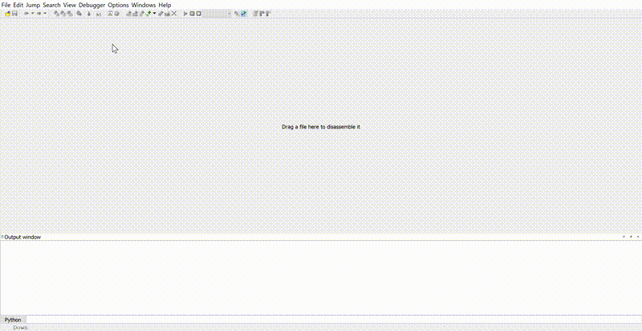

# etwbreaker
An IDA Plugin to find statically ETW events into a PE and generate a Conditional Breakpoint for facilitate Security Research.



## How To Install ?

Just put the `etwbreaker.py` script in `plugins` folder of IDA.

```
git clone git@github.com:Airbus-CERT/etwbreaker.git
mklink "C:\\Program Files\\IDA Pro 7.4\\plugins\\etwbreaker.py" "etwbreaker\etwbreaker.py"
```

Launch your IDA and press `Ctrl-Shift-L` to activate it.

## How Does It Works ?

`ETWBreaker` try to find all references about ETW providers statically compiled into a Windows module.

### Manifest based Provider

`ETWBreaker` will try to find a ressource names `WEVT_TEMPLATE`. This ressource include the ETW manifest for the module.
Once we get all events availables, we can compute a signature and try to find associated symbol of the event to enrich analysis.
Then we can also generate a conditional breakpoint to debug the module only once the target event is triggered.


### Tracelogging provider

`Microsoft` recently add `Tracelogging` API, that is work over ETW but without manifest. 
Tracelogging encompass it's scheme directly into a special field of ETW name `ExtendedData`. 
Tracelogging API is a macro based API, it's means that scheme are generated during compilation step and can be retrieve statically.
Scheme data are contain in a bordered region, for security purpose, and can be retrieve very easily.

But, in oposite of manifest ETW, the link between event and provider are made at execution time, and all event have same id(0).
This is why we list only providers in case of Tracelogging.

## SSTIC (Symposium sur la sécurité des technologies de l'information et des communications)

This project is part of presentation made for [SSTIC](https://www.sstic.org/2020/presentation/quand_les_bleus_se_prennent_pour_des_chercheurs_de_vulnrabilites/)
